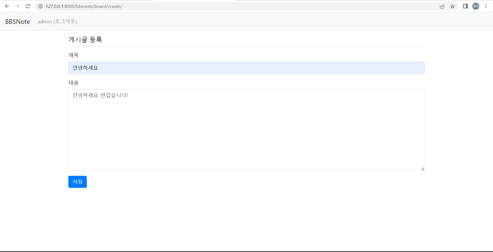
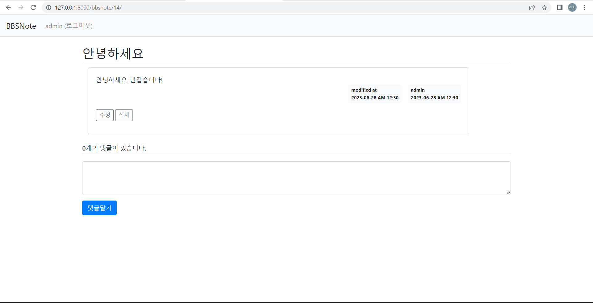

# BBSNote
게시판  
(BBS : Bulletin Board System)

 

## Description
Django를 활용해 게시판을 구축하여 사용자가 다음과 같은 기능을 이용할 수 있도록 함 
- 회원가입 기능
- 로그인/로그아웃 기능
- 게시물 등록/수정/삭제 기능
- 댓글 등록/수정/삭제 기능

 

## Tech Stacks  
     

 

## Output View
1. 홈 화면      

2. 계정생성 화면

3. 로그인 화면

4. 게시글 등록 화면

5. 댓글달기 화면
